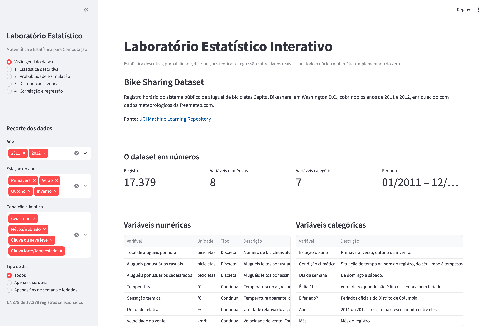
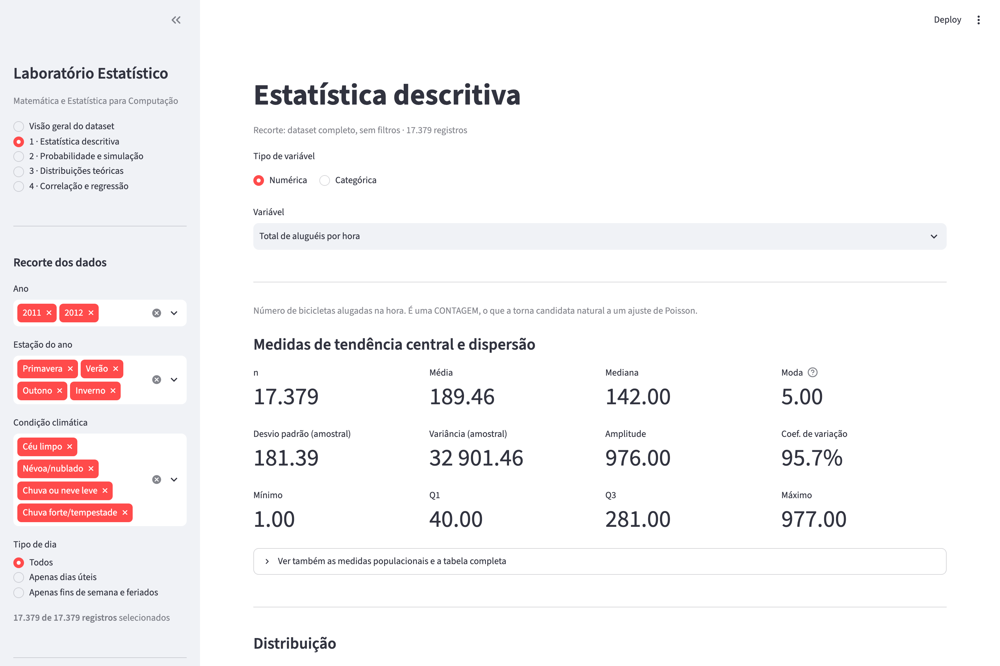
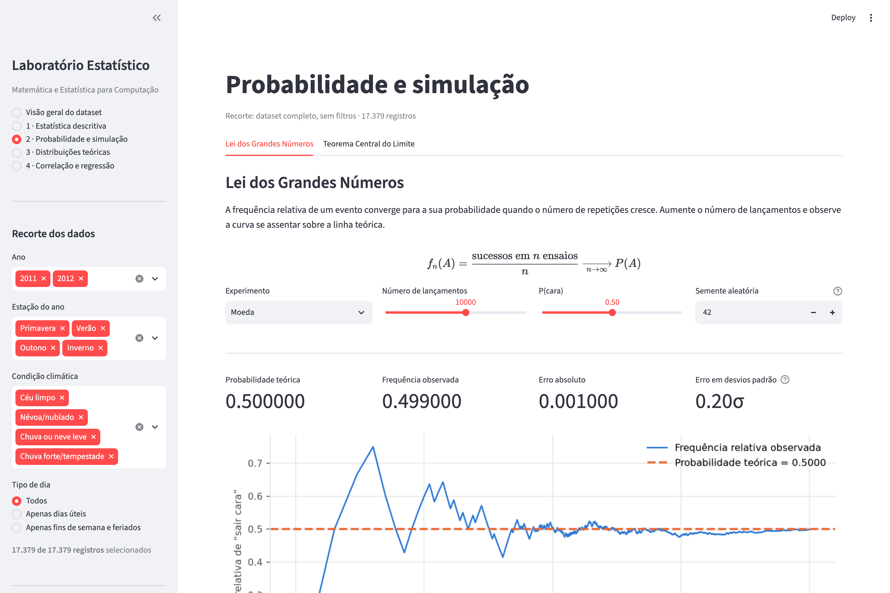
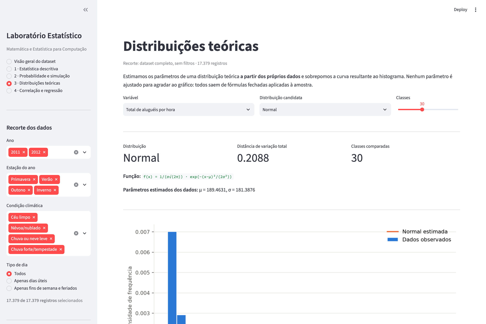
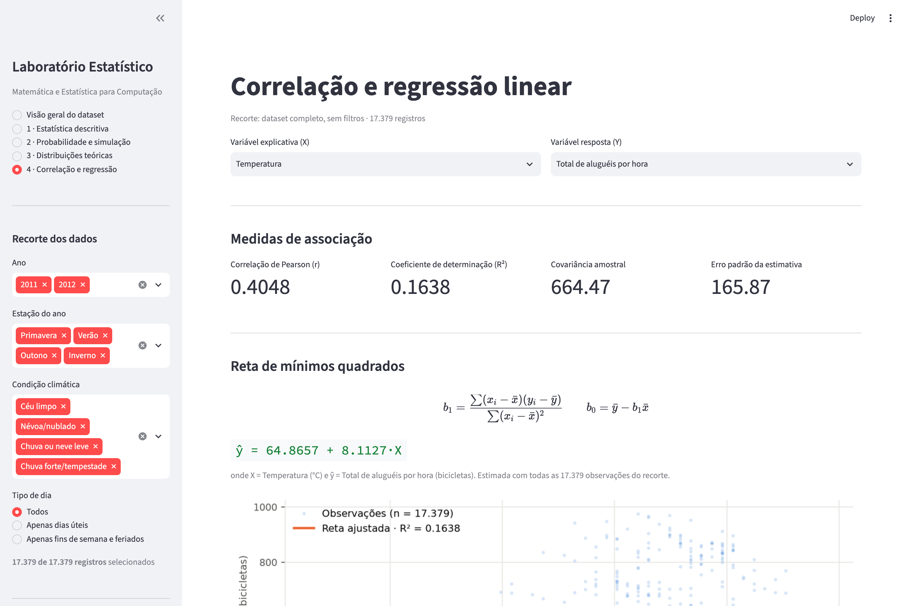

# Laboratório Estatístico Interativo

Aplicação web em Python/Streamlit que carrega um dataset público real e permite
explorá-lo por meio de estatística descritiva, simulação de Monte Carlo,
distribuições teóricas e regressão linear.

**O núcleo matemático foi implementado do zero.** Nenhuma medida exibida ao
usuário vem de `numpy.mean`, `scipy.stats` ou do módulo `statistics`: média,
mediana, moda, variância, quartis, correlação e regressão são calculadas com
somatórios e laços explícitos em [`core/`](core/), e depois validadas contra
NumPy e SciPy por **612 testes automatizados**.

**Disciplina:** Matemática e Estatística para Computação — CEUB

## Equipe

| Integrante | Matrícula |
|---|---|
| Plínio Roberto Pereira | *(preencher)* |
| Paulo César Farias Silva | *(preencher)* |
| Jhonata Bonadio | *(preencher)* |

## O dataset

**Bike Sharing Dataset** — registro horário do sistema público de aluguel de
bicicletas *Capital Bikeshare*, de Washington D.C., nos anos de 2011 e 2012,
enriquecido com dados meteorológicos.

- **Fonte:** [UCI Machine Learning Repository, dataset 275](https://archive.ics.uci.edu/dataset/275/bike+sharing+dataset)
- **Tamanho:** 17.379 registros (um por hora)
- **Variáveis numéricas:** 8 — total de aluguéis, usuários casuais, usuários
  cadastrados, temperatura, sensação térmica, umidade, vento e hora do dia
- **Variáveis categóricas:** 7 — estação do ano, condição climática, dia da
  semana, dia útil, feriado, mês e ano

Citação exigida pelos autores:

> Fanaee-T, Hadi & Gama, Joao (2013). *Event labeling combining ensemble
> detectors and background knowledge*. Progress in Artificial Intelligence,
> Springer Berlin Heidelberg. doi:10.1007/s13748-013-0040-3

A justificativa da escolha e as três descobertas estatísticas estão no
[RELATORIO.md](RELATORIO.md).

## Como executar do zero

Requisitos: **Python 3.11 ou superior** e Git.

```bash
# 1. Clonar o repositório
git clone https://github.com/jhonatabonadio1/interactive-stat-lab.git
cd interactive-stat-lab

# 2. Criar e ativar um ambiente virtual
python3 -m venv .venv
source .venv/bin/activate        # no Windows: .venv\Scripts\activate

# 3. Instalar as dependências
pip install -r requirements.txt

# 4. Rodar a aplicação
streamlit run app/principal.py
```

A aplicação abre sozinha em `http://localhost:8501`.

O dataset já está versionado em [`data/`](data/), então **não é preciso baixar
nada**. Se quiser refazer o download a partir da fonte original, pegue o arquivo
`hour.csv` do link do UCI acima e coloque-o nessa pasta.

### Rodar os testes

```bash
pytest
```

Os 612 testes cobrem a validação de todas as funções do núcleo contra NumPy e
SciPy, além de testes de fumaça que renderizam cada página da aplicação com cada
combinação de controles. A execução completa leva cerca de 45 segundos.

## A aplicação

### Visão geral do dataset
Origem, estrutura e justificativa da escolha dos dados.



### Módulo 1 — Estatística descritiva
O usuário escolhe uma variável e recebe tabela de frequências, todas as medidas
de tendência central e dispersão, histograma, boxplot, detecção de valores
atípicos pela regra do IQR e uma interpretação textual gerada automaticamente a
partir dos números.



### Módulo 2 — Probabilidade e simulação
Demonstrações de Monte Carlo da **Lei dos Grandes Números** (convergência da
frequência relativa em lançamentos de moeda e dado) e do **Teorema Central do
Limite** (distribuição das médias amostrais de uma variável real do dataset),
com número de repetições, tamanho de amostra e semente aleatória sob controle do
usuário.



### Módulo 3 — Distribuições teóricas
Sobreposição de Normal, Exponencial, Uniforme ou Poisson ao histograma de uma
variável real, com parâmetros estimados dos próprios dados e uma medida objetiva
de qualidade do ajuste.



### Módulo 4 — Correlação e regressão linear
Diagrama de dispersão, coeficiente de correlação, reta de mínimos quadrados, R²,
campo de predição interativa com aviso de extrapolação, diagnóstico de resíduos e
interpretação dos coeficientes.



## Estrutura do projeto

```
core/                    MATEMÁTICA PURA — sem nenhuma dependência de interface
  minhastats.py          Módulo 1: média, mediana, moda, variância, quartis,
                         CV, covariância, correlação de Pearson
  frequencias.py         tabelas de frequência e regra de Sturges
  simulacao.py           Lei dos Grandes Números e Teorema Central do Limite
  distribuicoes.py       Normal, Binomial, Poisson, Uniforme, Exponencial
  regressao.py           mínimos quadrados, R², predição

app/                     INTERFACE — importa e usa o core, nunca calcula
  principal.py           ponto de entrada do Streamlit
  dados.py               carregamento, desnormalização e catálogo de variáveis
  graficos.py            desenho dos gráficos a partir dos resultados do core
  tema.py                paleta e estilo
  paginas/               uma página por módulo

tests/                   VALIDAÇÃO — o único lugar onde NumPy/SciPy são a
                         referência, e não o objeto de estudo
data/                    o dataset
docs/imagens/            prints da aplicação
```

A separação entre `core/` e `app/` é estrita: `core/` não importa Streamlit,
matplotlib nem pandas, e pode ser usado, testado ou reaproveitado sozinho. Na
fronteira entre as duas camadas trafegam apenas listas de números do Python.

## A regra de ouro

Uma única regra organiza o projeto inteiro:

> Toda medida estatística exibida ao usuário precisa ter sido calculada por
> código nosso, a partir da fórmula matemática explícita.

Na prática:

| Onde | NumPy / SciPy / Pandas |
|---|---|
| `core/` | **proibidos** — só `math` da biblioteca padrão |
| `app/dados.py` | permitidos para ler o CSV, filtrar linhas e rotular categorias |
| `app/` (restante) | não calculam estatística; só desenham o que o core devolveu |
| `tests/` | **obrigatórios** — são a referência independente de validação |

Os gráficos seguem a mesma lógica: o histograma é desenhado a partir da tabela de
classes produzida por `core.frequencias`, e o boxplot a partir dos quartis
produzidos por `core.minhastats`. Não usamos `plt.hist` nem `plt.boxplot`, que
fariam os próprios cálculos por dentro e esconderiam justamente a matemática que
o trabalho pede.

## Validação

Cada função do núcleo é comparada com a implementação equivalente de uma
biblioteca consagrada, sobre sete conjuntos de dados diferentes — pequenos e
conferíveis à mão, grandes e aleatórios, simétricos, assimétricos, com valores
negativos, e o dataset real.

| Nossa função | Referência |
|---|---|
| `media` | `numpy.mean` |
| `mediana` | `numpy.median` |
| `moda` | `scipy.stats.mode` |
| `variancia` / `desvio_padrao` | `numpy.var` / `numpy.std` (ddof 0 e 1) |
| `percentil` / `quartis` | `numpy.percentile(method="linear")` |
| `amplitude_interquartil` | `scipy.stats.iqr` |
| `coeficiente_variacao` | `scipy.stats.variation` |
| `covariancia` | `numpy.cov` |
| `correlacao_pearson` | `numpy.corrcoef` e `scipy.stats.pearsonr` |
| `ajustar_regressao_linear` | `scipy.stats.linregress` e `numpy.polyfit` |
| `pdf_normal` / `cdf_normal` | `scipy.stats.norm` |
| `pmf_binomial` | `scipy.stats.binom` |
| `pmf_poisson` | `scipy.stats.poisson` |
| `pdf_uniforme` / `pdf_exponencial` | `scipy.stats.uniform` / `scipy.stats.expon` |
| `tabela_frequencias_continua` | `numpy.histogram` |
| `tabela_frequencias_categorica` | `pandas.Series.value_counts` |

**Tolerância numérica:** `math.isclose` com `rel_tol = 1e-9` e `abs_tol = 1e-12`.
A tolerância relativa é o critério principal, porque nossos somatórios são
ingênuos (acumulação sequencial em laço) enquanto o NumPy usa somatório por
pares, que acumula menos erro de arredondamento; para as 17 mil observações do
dataset, a diferença esperada entre os dois métodos é da ordem de 1e-13 relativo.
A tolerância absoluta cobre o caso em que o valor verdadeiro é zero, onde a
relativa se anula.

Além da comparação com bibliotecas, os testes verificam propriedades matemáticas
que precisam valer por construção — `SQ_tot = SQ_reg + SQ_res`, `R² = r²` na
regressão simples, soma dos resíduos nula, ortogonalidade entre resíduos e X, a
reta passando por `(x̄, ȳ)`, `r ∈ [−1, 1]`, as probabilidades de cada
distribuição somando 1, e a propriedade de falta de memória da Exponencial.

## Documentos do trabalho

- [RELATORIO.md](RELATORIO.md) — fórmulas em notação matemática, resultados da
  validação, explicação de cada módulo e as três descobertas
- [ROTEIRO_VIDEO.md](ROTEIRO_VIDEO.md) — roteiro da demonstração em vídeo
- [RESUMO_EXECUTIVO.md](RESUMO_EXECUTIVO.md) — resumo de uma página
