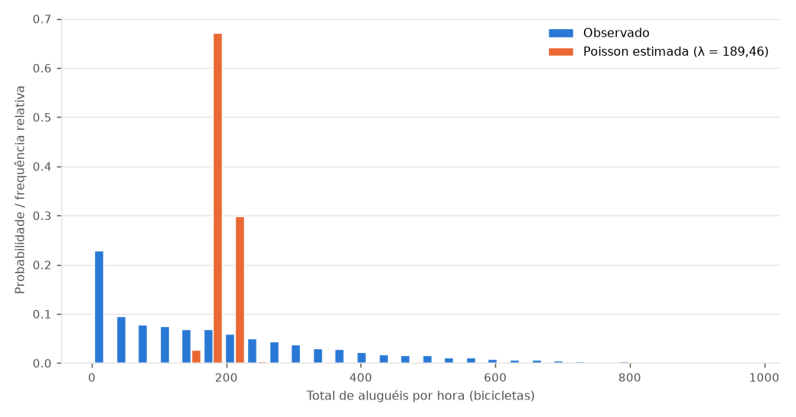
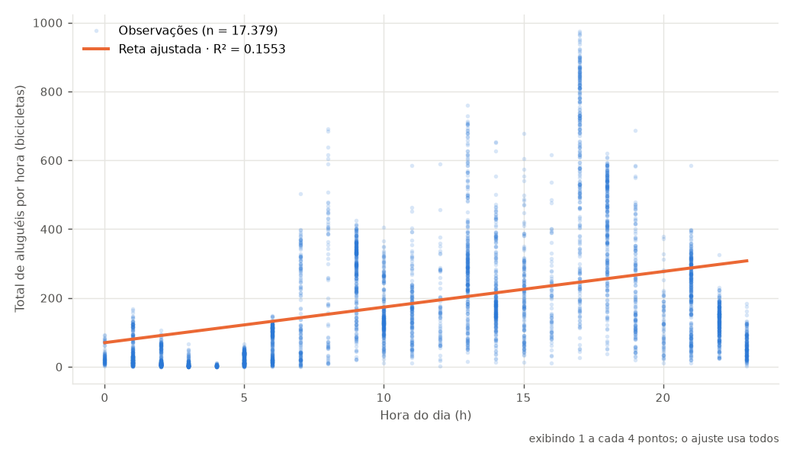
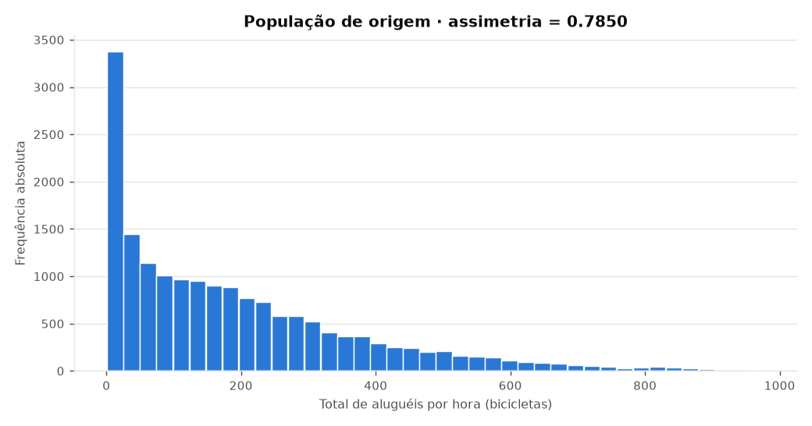
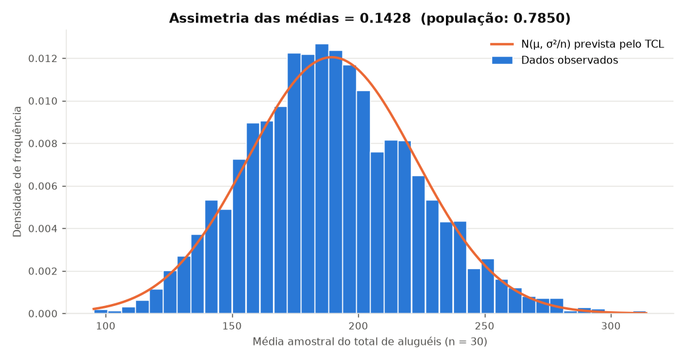

# Relatório — Laboratório Estatístico Interativo

**Disciplina:** Matemática e Estatística para Computação — CEUB
**Grupo:** Grupo Paulo, Jhonata e Plínio

| Integrante | Matrícula |
|---|---|
| Plínio Roberto Pereira | 72650385 |
| Paulo César Farias Silva | 72650229 |
| Jhonata Henrique Lima Bonadio | 72650384 |

---

## 1. O dataset e por que o escolhemos

### 1.1 Identificação

**Bike Sharing Dataset**, do UCI Machine Learning Repository
([dataset 275](https://archive.ics.uci.edu/dataset/275/bike+sharing+dataset)).
Contém o registro **horário** do sistema público de aluguel de bicicletas
*Capital Bikeshare*, de Washington D.C., ao longo de 2011 e 2012, cruzado com
dados meteorológicos da freemeteo.com.

| Requisito | Exigido | Neste dataset |
|---|---|---|
| Registros | ≥ 1.000 | **17.379** |
| Variáveis numéricas | ≥ 4 | **8** |
| Variáveis categóricas | ≥ 2 | **7** |

Citação exigida pelos autores:

> Fanaee-T, Hadi & Gama, Joao (2013). *Event labeling combining ensemble
> detectors and background knowledge*. Progress in Artificial Intelligence,
> Springer Berlin Heidelberg. doi:10.1007/s13748-013-0040-3

### 1.2 Justificativa

Comparamos quatro datasets candidatos (Bike Sharing, Wine Quality, Ames Housing e
Olist E-commerce). Todos atendiam aos requisitos numéricos; escolhemos o Bike
Sharing porque é o único em que **cada módulo do trabalho encontra um caso
natural**, em vez de um exemplo forçado:

- **Módulo 1 (descritiva).** `cnt`, o total de aluguéis por hora, é fortemente
  assimétrico à direita. Média e mediana discordam em 47 bicicletas, o que
  transforma a discussão "qual medida de tendência central usar" em algo
  concreto, e não em um exercício abstrato.
- **Módulo 2 (TCL).** É precisamente por partir de uma população assimétrica que
  a convergência das médias amostrais para a Normal impressiona. Numa população
  já simétrica, o teorema não teria nada a demonstrar.
- **Módulo 3 (distribuições).** Há quatro naturezas diferentes no mesmo arquivo:
  uma contagem (`cnt`, candidata a Poisson), uma variável aproximadamente
  simétrica (temperatura, candidata a Normal), uma com cauda longa e excesso de
  zeros (vento, candidata a Exponencial) e uma quase perfeitamente plana (hora
  do dia, candidata a Uniforme).
- **Módulo 4 (regressão).** Temperatura contra aluguéis produz uma reta cuja
  inclinação tem leitura imediata — quantas bicicletas a mais por grau Celsius.

Havia ainda um motivo prático: o arquivo é distribuído por URL direta, sem
exigir login, o que torna o projeto reproduzível por qualquer pessoa que clone o
repositório.

---

## 2. Decisões de tratamento dos dados

### 2.1 A inspeção inicial

Antes de escrever qualquer função, rodamos a inspeção de sanidade sobre o
arquivo bruto. O resultado, reproduzível com `pandas`:

| Verificação | Resultado |
|---|---|
| Dimensões | 17.379 linhas × 17 colunas |
| Valores ausentes | **0** em todas as colunas |
| Colunas de texto onde deveria haver número | **nenhuma** — todas as 17 já vêm numéricas |
| Colunas constantes (sem variação) | **nenhuma** |
| Categóricas com excesso de níveis | nenhuma — a maior tem 12 níveis (`mnth`) |

**Conclusão: nenhuma linha foi removida e nenhum valor foi imputado.** Isso não
é sorte, e sim consequência da escolha: o dataset já passou por curadoria dos
autores na publicação. Registramos o resultado da inspeção justamente porque
"não precisou de tratamento" só é uma afirmação defensável quando existe a
verificação por trás.

A única decisão de exclusão que tomamos é de escopo, não de limpeza: o pacote
do UCI traz dois arquivos, `hour.csv` (17.379 registros horários) e `day.csv`
(731 registros diários). Usamos **apenas o horário**, porque o agregado diário
tem menos de 1.000 registros e não atenderia ao requisito mínimo — e porque a
hora do dia acabou se revelando a variável mais informativa de todo o conjunto,
como mostra a Descoberta 2.

### 2.2 Conversão de tipos e rotulagem das categóricas

As variáveis categóricas vêm codificadas como inteiros (`season` de 1 a 4,
`weathersit` de 1 a 4, `weekday` de 0 a 6). Mantivemos as colunas originais
intactas e **acrescentamos** colunas rotuladas (`estacao`, `clima`,
`dia_semana`), em vez de sobrescrever. Duas razões: a coluna original continua
disponível para conferência, e a aplicação exibe rótulos legíveis sem que o
usuário precise consultar a documentação do dataset.

A coluna `dteday` é convertida para data com `pd.to_datetime`, usada apenas
para exibir o período coberto.

### 2.3 A fronteira entre o pandas e o núcleo

Todo o tratamento acima acontece em `app/dados.py` e usa pandas à vontade —
carregar, filtrar, mapear rótulos. A conversão para o núcleo é explícita e
acontece num único ponto:

```python
def serie_numerica(dados, chave):
    return dados[chave].astype(float).tolist()
```

Esse `.tolist()` é a fronteira da regra de ouro. Daí para dentro de `core/`
trafegam apenas listas de `float` do Python — nunca `Series` do pandas ou
arrays do NumPy, que trariam junto os métodos estatísticos que não podemos usar.

### 2.4 Uma correção na documentação oficial do dataset

As variáveis meteorológicas vêm normalizadas no intervalo [0, 1]. Para que as
medidas e os coeficientes de regressão tivessem significado físico,
reconstruímos as unidades originais — e aí encontramos uma divergência.

O `Readme.txt` distribuído junto com o dataset (2013) afirma que `temp` foi
*"dividida por 41"*. A página atual do UCI, porém, documenta uma normalização
min-máx:

$$\text{temp} = \frac{t - (-8)}{39 - (-8)} \qquad\qquad \text{atemp} = \frac{t - (-16)}{50 - (-16)}$$

As duas fórmulas são incompatíveis. Testamos ambas contra a climatologia real de
Washington D.C., mês a mês:

| Mês | Pela fórmula do Readme (t/41) | Pela min-máx | Média histórica de Washington D.C. |
|---|---|---|---|
| Janeiro | 9,7 °C | **3,2 °C** | ≈ 1,9 °C |
| Abril | 19,3 °C | **14,1 °C** | ≈ 13,8 °C |
| Julho | 31,0 °C | **27,5 °C** | ≈ 26,6 °C |
| Outubro | 20,0 °C | **14,9 °C** | ≈ 15,2 °C |

A fórmula do `Readme.txt` superestima a temperatura em cerca de 6 °C em todos os
meses; a min-máx acompanha a cidade nos doze. **Concluímos que o `Readme.txt`
está errado** e adotamos a min-máx, com a justificativa registrada em
`app/dados.py`. Foi a primeira lição prática do trabalho: documentação de dataset
não é fonte confiável sem verificação.

---

## 3. Arquitetura e a regra de ouro

O projeto é dividido em duas camadas que não se misturam:

```
core/    matemática pura — sem Streamlit, sem matplotlib, sem pandas
app/     interface — importa e usa o core, nunca calcula
tests/   validação — o único lugar onde NumPy/SciPy são referência
```

A regra que organiza tudo:

> Toda medida estatística exibida ao usuário precisa ter sido calculada por
> código nosso, a partir da fórmula matemática explícita.

Em `core/`, a única dependência permitida é o módulo `math` da biblioteca padrão
— e dele usamos apenas funções matemáticas elementares e especiais (`sqrt`,
`exp`, `log`, `erf`, `lgamma`), nunca uma rotina estatística pronta.

A regra se estende aos gráficos. O histograma é desenhado a partir da tabela de
classes que `core.frequencias` produz, e o boxplot a partir dos quartis que
`core.minhastats` produz. Não usamos `plt.hist` nem `plt.boxplot`, porque essas
funções fariam os próprios cálculos por dentro e esconderiam exatamente a
matemática que o trabalho pede.

Na fronteira entre as camadas trafegam apenas listas de números do Python —
nunca `Series` do pandas ou arrays do NumPy.

---

## 4. Fórmulas implementadas

Notação: $n$ é o tamanho do conjunto, $x_i$ a $i$-ésima observação, $\bar{x}$ a
média e $\sum$ o somatório de $i = 1$ até $n$.

### 4.1 Tendência central

$$\bar{x} = \frac{1}{n}\sum_{i=1}^{n} x_i$$

$$Md = \begin{cases} x_{\left(\frac{n+1}{2}\right)} & \text{se } n \text{ é ímpar} \\[6pt] \dfrac{x_{\left(\frac{n}{2}\right)} + x_{\left(\frac{n}{2}+1\right)}}{2} & \text{se } n \text{ é par} \end{cases}$$

$$Mo = \{\, x : f(x) = \max f \,\}$$

A moda é devolvida como uma **lista**, porque um conjunto pode ser bimodal ou
multimodal. Se toda frequência vale 1, o conjunto é amodal e a lista é vazia.

### 4.2 Dispersão

$$A = x_{\max} - x_{\min}$$

$$\sigma^2 = \frac{1}{n}\sum (x_i - \bar{x})^2 \qquad\qquad s^2 = \frac{1}{n-1}\sum (x_i - \bar{x})^2$$

$$\sigma = \sqrt{\sigma^2} \qquad\qquad s = \sqrt{s^2}$$

O divisor $(n-1)$ na versão amostral é a **correção de Bessel**: ao usar
$\bar{x}$, estimada dos próprios dados, no lugar de $\mu$, os desvios ficam
sistematicamente pequenos demais, e dividir por $n-1$ corrige esse viés. Uma
consequência é que $s^2 > \sigma^2$ sempre — propriedade verificada em teste.

$$CV = \frac{s}{|\bar{x}|} \times 100\%$$

### 4.3 Separatrizes

Sobre o conjunto ordenado, a posição do percentil de ordem $p$ é

$$h = (n-1)\cdot\frac{p}{100}$$

$$P_p = x_{(\lfloor h \rfloor + 1)} + (h - \lfloor h \rfloor)\cdot\left[x_{(\lceil h \rceil + 1)} - x_{(\lfloor h \rfloor + 1)}\right]$$

Esta é a interpolação linear, o mesmo método que `numpy.percentile` adota por
padrão, o que torna a comparação nos testes direta. Daí saem
$Q_1 = P_{25}$, $Q_2 = P_{50} = Md$, $Q_3 = P_{75}$ e $IQR = Q_3 - Q_1$.

### 4.4 Forma e valores atípicos

$$As = \frac{3(\bar{x} - Md)}{s}$$

Escolhemos o segundo coeficiente de assimetria de Pearson, e não o momento
padronizado de terceira ordem, porque ele expressa exatamente a comparação
média × mediana que a interpretação automática do Módulo 1 apresenta ao usuário.

Cercas de Tukey, com $k = 1{,}5$:

$$\text{cerca inferior} = Q_1 - k\cdot IQR \qquad\qquad \text{cerca superior} = Q_3 + k\cdot IQR$$

### 4.5 Medidas bivariadas

$$s_{xy} = \frac{1}{n-1}\sum (x_i - \bar{x})(y_i - \bar{y})$$

$$r = \frac{s_{xy}}{s_x \cdot s_y} = \frac{\sum (x_i - \bar{x})(y_i - \bar{y})}{\sqrt{\sum (x_i - \bar{x})^2 \cdot \sum (y_i - \bar{y})^2}}$$

Implementamos a segunda forma, que usa uma única passagem de somatórios e evita
a divisão intermediária por $(n-1)$, que se cancela.

### 4.6 Regressão linear simples

O método dos mínimos quadrados escolhe $b_0$ e $b_1$ que minimizam

$$SQ_{res}(b_0, b_1) = \sum \left(y_i - b_0 - b_1 x_i\right)^2$$

Derivando em relação a cada parâmetro e igualando a zero, obtêm-se as equações
normais, cuja solução é

$$b_1 = \frac{\sum (x_i - \bar{x})(y_i - \bar{y})}{\sum (x_i - \bar{x})^2} = \frac{S_{xy}}{S_{xx}} \qquad\qquad b_0 = \bar{y} - b_1\bar{x}$$

A segunda equação mostra que a reta ajustada **sempre passa pelo ponto médio**
$(\bar{x}, \bar{y})$, quaisquer que sejam os dados.

Decomposição da variabilidade de $Y$:

$$\underbrace{\sum (y_i - \bar{y})^2}_{SQ_{tot}} = \underbrace{\sum (\hat{y}_i - \bar{y})^2}_{SQ_{reg}} + \underbrace{\sum (y_i - \hat{y}_i)^2}_{SQ_{res}}$$

$$R^2 = \frac{SQ_{reg}}{SQ_{tot}} = 1 - \frac{SQ_{res}}{SQ_{tot}}$$

$$s_e = \sqrt{\frac{SQ_{res}}{n-2}} \qquad\qquad s_{b_1} = \frac{s_e}{\sqrt{S_{xx}}}$$

### 4.7 Distribuições teóricas

$$f(x) = \frac{1}{\sigma\sqrt{2\pi}}\exp\left[-\frac{(x-\mu)^2}{2\sigma^2}\right] \qquad\qquad F(x) = \frac{1}{2}\left[1 + \operatorname{erf}\left(\frac{x-\mu}{\sigma\sqrt{2}}\right)\right]$$

$$P(X=k) = \binom{n}{k}p^k(1-p)^{n-k} \qquad\qquad P(X=k) = \frac{e^{-\lambda}\lambda^k}{k!}$$

$$f(x) = \frac{1}{b-a},\ a \le x \le b \qquad\qquad f(x) = \lambda e^{-\lambda x},\ x \ge 0$$

**Um detalhe de implementação que importa.** Calcular $\lambda^k / k!$ em escala
linear é inviável: com $\lambda = 189$ e $k = 977$, o numerador estoura a faixa
do `float` muito antes de o denominador compensá-lo. Calculamos em escala
logarítmica,

$$\ln P(X=k) = -\lambda + k\ln\lambda - \ln\Gamma(k+1)$$

usando `math.lgamma`, e só então exponenciamos. A função gama é a extensão
contínua do fatorial — uma função matemática especial, não uma rotina
estatística, e portanto dentro da regra de ouro. O mesmo tratamento se aplica ao
coeficiente binomial.

### 4.8 Simulação

$$f_n(A) = \frac{\text{sucessos em } n \text{ ensaios}}{n} \xrightarrow[n\to\infty]{} P(A)$$

$$\bar{X} \xrightarrow[\ n\to\infty\ ]{} N\!\left(\mu, \frac{\sigma^2}{n}\right) \qquad\qquad \sigma_{\bar{X}} = \frac{\sigma}{\sqrt{n}}$$

A fonte de aleatoriedade é `random.Random` da biblioteca padrão — um gerador de
números pseudoaleatórios, não uma biblioteca de estatística. Nenhuma medida
calculada sobre os resultados sorteados vem de biblioteca externa: média e desvio
padrão das médias amostrais continuam saindo de `core/minhastats.py`. Toda
simulação aceita uma semente, de modo que os números citados neste relatório
podem ser reproduzidos exatamente.

---

## 5. Resultados da validação

### 5.1 Estratégia

Cada função do núcleo é comparada com a implementação equivalente de uma
biblioteca consagrada, sobre **sete conjuntos de dados** escolhidos para cobrir
cenários diferentes: um pequeno e conferível à mão com $n$ par, um com $n$ ímpar,
uma amostra normal grande, uma amostra exponencial (assimétrica), uma com valores
negativos, e duas variáveis reais do dataset.

Para cada função medimos a **maior divergência observada** contra a referência,
varrendo as oito variáveis numéricas do dataset (e, nas medidas bivariadas, os
28 pares possíveis entre elas). A coluna de diferença é a maior divergência
*relativa* encontrada em toda a varredura — o pior caso, não a média.

| Nossa função | Referência de validação | Maior diferença observada | Testes |
|---|---|---|---|
| `media` | `numpy.mean` | 5,0 × 10⁻¹⁴ | 7 |
| `mediana` | `numpy.median` | **exata** (0) | 9 |
| `moda` | `scipy.stats.mode` | **exata** (0) | 9 |
| `amplitude`, `minimo`, `maximo` | `numpy.ptp`, `numpy.min`, `numpy.max` | **exata** (0) | 14 |
| `variancia`, `desvio_padrao` | `numpy.var`, `numpy.std` (ddof 0 e 1) | 8,2 × 10⁻¹⁴ | 24 |
| `percentil` | `numpy.percentile(method="linear")` | **exata** (0) | 92 |
| `quartis` | `numpy.percentile` | **exata** (0) | 21 |
| `amplitude_interquartil` | `scipy.stats.iqr` | **exata** (0) | 7 |
| `coeficiente_variacao` | `scipy.stats.variation` | 3,9 × 10⁻¹⁴ | 9 |
| `assimetria_pearson` | fórmula fechada sobre NumPy | 2,5 × 10⁻¹² | 9 |
| `outliers_iqr` | cercas calculadas com NumPy | **exata** (0) | 15 |
| `covariancia` | `numpy.cov` | 7,3 × 10⁻¹⁴ | 4 |
| `correlacao_pearson` | `numpy.corrcoef`, `scipy.stats.pearsonr` | 1,2 × 10⁻¹³ | 13 |
| `resumo_descritivo` e entradas inválidas | NumPy e `pytest.raises` | — | 5 |
| `ajustar_regressao_linear` — b₁ | `scipy.stats.linregress` | 9,2 × 10⁻¹⁴ | |
| `ajustar_regressao_linear` — b₀ | `scipy.stats.linregress` | 6,1 × 10⁻¹² | 42 |
| `ajustar_regressao_linear` — R² | `scipy.stats.linregress` | **1,7 × 10⁻¹⁰** | |
| `ajustar_regressao_linear` — s(b₁) | `scipy.stats.linregress` | 4,4 × 10⁻¹⁴ | |
| `pdf_normal` | `scipy.stats.norm` | 2,2 × 10⁻¹⁶ | 71 |
| `cdf_normal` | `scipy.stats.norm` | 1,2 × 10⁻¹³ | |
| `pmf_binomial` | `scipy.stats.binom` | 7,3 × 10⁻¹² | 14 |
| `pmf_poisson` | `scipy.stats.poisson` | 1,8 × 10⁻¹² | 15 |
| `pdf_uniforme`, `cdf_uniforme` | `scipy.stats.uniform` | **exata** (0) | 43 |
| `pdf_exponencial`, `cdf_exponencial` | `scipy.stats.expon` | 1,9 × 10⁻¹⁶ | 40 |
| Catálogo de distribuições da interface | execução de ponta a ponta | — | 2 |
| `regra_de_sturges` | `math.log2` e cálculo manual | **exata** (0) | 19 |
| `tabela_frequencias_continua` | `numpy.histogram` | **exata** (0) | 28 |
| `tabela_frequencias_categorica` | `pandas.Series.value_counts` | **exata** (0) | 10 |
| Simulação (LGN e TCL) | `scipy.stats.chisquare`, `scipy.stats.shapiro` | — | 42 |
| Interface (Streamlit `AppTest`) | renderização sem exceção | — | 48 |
| **Total** | | **pior caso: 1,7 × 10⁻¹⁰** | **612** |

**Leitura da tabela.** Doze das nossas funções batem com a referência de forma
**exata** — diferença zero, nem na última casa. São justamente as que não fazem
somatório: mediana, moda, percentis e quartis apenas selecionam e interpolam
valores existentes, e as tabelas de frequência contam inteiros. Onde há
somatório, aparece a divergência de ponto flutuante esperada, na ordem de
10⁻¹⁴ a 10⁻¹².

O pior caso de todos é o **R² da regressão, com 1,7 × 10⁻¹⁰** — ainda uma ordem
de grandeza dentro da tolerância de 10⁻⁹. Ele é o maior porque é a medida mais
composta da tabela: acumula erro de três somatórios encadeados
(SQ_res, SQ_tot e a divisão entre eles), e a subtração `1 − SQ_res/SQ_tot`
sofre cancelamento quando o R² é pequeno — que é exatamente o nosso caso, com
R² em torno de 0,16.

Todos passam, em cerca de 45 segundos. Por arquivo: `test_minhastats.py` 238,
`test_distribuicoes.py` 185, `test_frequencias.py` 57, `test_aplicacao.py` 48,
`test_regressao.py` 42, `test_simulacao.py` 42.

### 5.2 Tolerância numérica

As comparações de ponto flutuante usam `math.isclose` com

$$\texttt{rel\_tol} = 10^{-9} \qquad\qquad \texttt{abs\_tol} = 10^{-12}$$

A tolerância **relativa** é o critério principal. Nossos somatórios são ingênuos
— acumulação sequencial em laço — enquanto o NumPy usa somatório por pares, que
agrupa os termos em árvore e acumula menos erro de arredondamento. Para as 17 mil
observações do dataset, a diferença esperada entre os dois métodos é da ordem de
$10^{-13}$ relativo, bem dentro do limite. A tolerância **absoluta** existe
apenas para o caso em que o valor verdadeiro é zero, onde a relativa se anula.

### 5.3 Além da comparação: propriedades que precisam valer

Comparar com uma biblioteca prova que chegamos ao mesmo número, mas não que a
implementação é internamente coerente. Por isso os testes também verificam
propriedades matemáticas que precisam valer por construção:

- $SQ_{tot} = SQ_{reg} + SQ_{res}$ (identidade fundamental da ANOVA)
- $R^2 = r^2$ na regressão simples
- $\sum e_i = 0$ e $\sum x_i e_i = 0$ (as duas equações normais)
- a reta ajustada passa por $(\bar{x}, \bar{y})$
- $r \in [-1, +1]$, por Cauchy-Schwarz
- $\operatorname{cov}(x,x) = \operatorname{var}(x)$ e $\operatorname{cov}(x,y) = \operatorname{cov}(y,x)$
- $s^2 > \sigma^2$ (efeito da correção de Bessel)
- $Q_1 \le Q_2 \le Q_3$, e $Q_2$ idêntico à mediana
- as probabilidades de cada distribuição discreta somam 1; a densidade normal
  integra 1 por trapézios; vale a regra empírica 68–95–99,7
- a Exponencial não tem memória: $P(X > s+t \mid X > s) = P(X > t)$
- nenhuma observação se perde na tabela de frequências, e as classes são
  contíguas e de mesma amplitude

### 5.4 Duas divergências encontradas pelos testes

**A constante de Sturges.** A fórmula é normalmente apresentada como
$k = \lceil 1 + 3{,}322\log_{10} n \rceil$. A constante 3,322 é o arredondamento
de $1/\log_{10}2 = 3{,}321928\ldots$ e, por ser ligeiramente **maior** que o
valor exato, produz uma classe a mais quando $n$ é potência exata de 2: com
$n = 2$, dá $\lceil 2{,}00002 \rceil = 3$, enquanto o valor exato dá
$\lceil 2 \rceil = 2$. O teste que comparava a implementação com
$\lceil 1 + \log_2 n \rceil$ falhou e expôs o problema. Passamos a usar
`math.log2`, que é exato.

**O ponto de entrada da aplicação.** O Streamlit registra o script executado em
`sys.modules` sob o nome do arquivo. Um `app/app.py` era registrado como módulo
`app`, sombreava o **pacote** `app` e quebrava `from app import dados` com um erro
de importação circular. Só apareceu quando escrevemos os testes de interface com
`AppTest`. O arquivo passou a se chamar `app/principal.py`.

---

## 6. Os módulos da aplicação

Todos os prints desta seção são da aplicação em execução, sem edição.

### Módulo 0 — Visão geral do dataset

Origem, estrutura, justificativa da escolha e a discussão sobre a
desnormalização. A barra lateral traz os filtros globais — ano, estação,
condição climática e tipo de dia — que se aplicam a todos os módulos seguintes,
de modo que qualquer análise pode ser refeita sobre um recorte.


### Módulo 1 — Estatística descritiva interativa


O usuário escolhe uma variável, numérica ou categórica, e recebe:

- **tabela de frequências** — para variáveis contínuas, com classes de igual
  amplitude (número sugerido pela regra de Sturges, ajustável por um controle),
  trazendo $f_i$, $f_{ri}$, $F_i$, $F_{ri}$ e ponto médio de cada classe; para
  categóricas, a contagem por categoria ordenada por frequência;
- **todas as medidas** do Módulo 1, incluindo as versões amostral e populacional
  de variância e desvio padrão lado a lado;
- **histograma** desenhado a partir da nossa tabela de classes, e **boxplot**
  desenhado a partir dos nossos quartis, com a média marcada em losango para
  contrastar visualmente com a mediana;
- **detecção de valores atípicos** pela regra do IQR, com as cercas explícitas;
- **interpretação textual automática**, montada a partir dos números — compara
  média e mediana para diagnosticar assimetria, classifica a dispersão pelo CV,
  quantifica os atípicos e avisa quando a proporção passa de 5% que o problema
  provavelmente não é erro de medição, e sim uma cauda longa genuína.

Para variáveis categóricas, a interpretação encerra lembrando que média, mediana
e desvio padrão **não fazem sentido** ali: as categorias não têm distância
numérica entre si.

### Módulo 2 — Probabilidade e simulação de Monte Carlo


**(a) Lei dos Grandes Números.** Simulação de lançamentos de moeda (com $P$(cara)
ajustável) ou de dado de 6 a 20 faces. O gráfico traz a frequência relativa
acumulada contra a probabilidade teórica, com o eixo horizontal em **escala
logarítmica** — a convergência acontece em ordens de grandeza, e num eixo linear
os primeiros milhares de lançamentos, justamente onde está toda a ação,
virariam uma faixa ilegível colada no zero. Pela mesma razão, a reamostragem da
trajetória para plotagem é feita em escala logarítmica, e não uniformemente.

A aplicação reporta o erro em **desvios padrão**, usando
$\sqrt{p(1-p)/n}$ como referência, para que o usuário saiba se o desvio
observado é o esperado ou é surpreendente.

**(b) Teorema Central do Limite.** Sorteia amostras repetidas de uma variável
real do dataset e estuda a distribuição das médias. A curva Normal sobreposta
**não é ajustada ao histograma**: é a $N(\mu, \sigma^2/n)$ que a teoria prevê a
partir de $\mu$ e $\sigma$ da população. A aplicação compara lado a lado o erro
padrão teórico $\sigma/\sqrt{n}$ e o observado nas médias simuladas, e exibe a
razão entre eles.

### Módulo 3 — Distribuições teóricas


Sobreposição de Normal, Exponencial, Uniforme ou Poisson ao histograma de uma
variável real, com parâmetros estimados dos próprios dados:

$$\hat{\mu} = \bar{x},\ \hat{\sigma} = s \qquad \hat{\lambda}_{\text{Poisson}} = \bar{x} \qquad \hat{\lambda}_{\text{Exp}} = 1/\bar{x} \qquad \hat{a} = x_{\min},\ \hat{b} = x_{\max}$$

As candidatas oferecidas são filtradas pelo **suporte** da distribuição: não faz
sentido propor uma Exponencial para uma variável que assume valores negativos,
nem uma Poisson para uma variável não inteira.

Para medir a qualidade do ajuste usamos a **distância de variação total**:

$$d_{VT} = \frac{1}{2}\sum_{\text{classes}} \left| f_{obs}(\text{classe}) - P_{modelo}(\text{classe}) \right|$$

Ela vale 0 num ajuste perfeito e 1 no pior caso, e tem leitura direta: é a maior
diferença de probabilidade que o modelo comete em qualquer evento. Preferimos
essa medida ao qui-quadrado porque **ela não depende do tamanho da amostra** —
com $n = 17.379$, um teste qui-quadrado rejeitaria qualquer modelo, inclusive um
bom, e não serviria para comparar candidatos.

### Módulo 4 — Correlação e regressão linear


Diagrama de dispersão, coeficiente de correlação, reta de mínimos quadrados,
equação formatada, $R^2$, erro padrão da estimativa, campo de predição
interativa, diagnóstico de resíduos e interpretação dos coeficientes.

Três cuidados que a aplicação toma e que valem registro:

1. **Aviso de extrapolação.** Se o $X$ digitado cai fora do intervalo observado,
   a aplicação avisa que a reta foi estimada apenas dentro desse intervalo.
2. **Aviso de predição impossível.** Se $\hat{y}$ resulta negativo para uma
   variável que nunca é negativa nos dados, a aplicação sinaliza — é uma
   limitação do modelo linear, que não conhece o limite inferior zero.
3. **Correlação não implica causalidade.** Exibido em destaque, com as três
   explicações alternativas: a relação pode ser inversa, pode haver uma terceira
   variável influenciando ambas, ou pode ser coincidência.

---

## 7. As três descobertas

### Descoberta 1 — Ser uma contagem não faz de uma variável uma Poisson

`cnt` é o número de bicicletas alugadas por hora: um inteiro não negativo, o
caso de livro-texto da distribuição de Poisson. Ajustamos, e o resultado foi o
**pior de todos os candidatos testados**.



| Candidata | Distância de variação total |
|---|---|
| Exponencial | **0,1061** |
| Normal | 0,2088 |
| Uniforme | 0,4717 |
| **Poisson** | **0,8422** |

O diagnóstico está no **índice de dispersão**. Uma Poisson genuína tem
$E[X] = \operatorname{Var}[X] = \lambda$, de modo que a razão vale 1. Aqui:

$$\hat{\lambda} = \bar{x} = 189{,}46 \qquad s^2 = 32.901{,}46 \qquad \frac{s^2}{\hat{\lambda}} = \mathbf{173{,}66}$$

Os dados variam **174 vezes mais** do que uma Poisson permitiria. A consequência
visual é dramática: com $\lambda = 189$, o desvio padrão de uma Poisson seria
$\sqrt{189} \approx 13{,}8$, então praticamente toda a massa se concentraria no
intervalo $[148, 231]$ — é por isso que, no gráfico, as barras laranja empilham
97% da probabilidade em duas classes, enquanto os dados observados se espalham
de 1 a 977.

**A causa é conceitual, não numérica.** A Poisson pressupõe uma taxa $\lambda$
**constante**. Mas a demanda por bicicletas às 8h de uma terça ensolarada não
tem nada a ver com a demanda às 3h de uma madrugada chuvosa — a média por hora
do dia vai de **6 bicicletas às 4h a 461 às 17h**. Não existe um $\lambda$
único; existe um $\lambda(t)$. É um resultado negativo, e é justamente por isso
que ele ensina: o formato dos dados (contagem inteira) sugeriu a família errada,
e só a verificação quantitativa revelou o problema.

### Descoberta 2 — O coeficiente de Pearson subestima em 3× o efeito da hora do dia

Ao ordenar as variáveis pela correlação com `cnt`, a temperatura parece ser o
fator dominante e a hora do dia, secundária:

| Variável | $r$ com `cnt` | $R^2$ de uma reta |
|---|---|---|
| Temperatura | +0,4048 | 0,1638 |
| Sensação térmica | +0,4009 | 0,1607 |
| **Hora do dia** | **+0,3941** | **0,1553** |
| Umidade | −0,3229 | 0,1043 |
| Vento | +0,0932 | 0,0087 |

Mas o diagrama de dispersão mostra por que essa leitura é enganosa:



A nuvem tem **dois picos** — um às 8h e outro, maior, às 17–18h — com um vale
profundo de madrugada. É o padrão de deslocamento casa–trabalho. A reta ajustada
sobe monotonicamente e passa longe de descrever isso.

Como $r$ mede **exclusivamente associação linear**, ele não enxerga esse padrão.
Para quantificar o que a hora realmente explica, calculamos a **razão de
correlação** $\eta^2$, que não pressupõe forma alguma da relação:

$$\eta^2 = \frac{SQ_{entre\ horas}}{SQ_{total}} = \frac{\sum_{h} n_h(\bar{y}_h - \bar{y})^2}{\sum_i (y_i - \bar{y})^2} = \mathbf{0{,}5015}$$

A hora do dia explica **50,2%** da variação no número de aluguéis, contra os
15,5% que a reta capta. **O modelo linear enxerga menos de um terço do efeito
real.** A temperatura, que parecia a variável mais forte, explica 16,4% — um
terço do poder explicativo da hora.

A lição é geral e vale para qualquer análise: $r \approx 0$ **não** significa
ausência de relação, significa ausência de relação *linear*. Olhar o diagrama de
dispersão antes de confiar no coeficiente não é preciosismo, é o que separa a
conclusão correta da errada.

### Descoberta 3 — O TCL não só funciona sobre dados torcidos, como acerta o número

`cnt` é tudo o que uma variável bem-comportada não é: assimetria de Pearson
**0,7850**, coeficiente de variação de **95,7%** (o desvio padrão quase iguala a
média), 505 observações atípicas pela regra do IQR e uma cerca inferior de
**−321,5** bicicletas — um valor impossível, que denuncia a inadequação de uma
regra pensada para distribuições aproximadamente simétricas.



Ainda assim, ao sortear amostras dessa população e olhar as médias:



| $n$ da amostra | Assimetria das médias | $\sigma/\sqrt{n}$ teórico | Observado | Razão |
|---|---|---|---|---|
| 2 | 0,5232 | 128,257 | 130,315 | 1,0160 |
| 5 | 0,3729 | 81,117 | 83,034 | 1,0236 |
| 30 | 0,1428 | 33,116 | 33,247 | **1,0040** |
| 100 | 0,0802 | 18,138 | 18,392 | 1,0140 |
| 200 | **0,0255** | 12,826 | 12,770 | 0,9957 |

*(5.000 amostras por linha, semente 7 — reproduzível na aplicação.)*

Dois resultados, e o segundo é o que nos surpreendeu:

1. **A assimetria desaparece.** De 0,7850 na população para 0,0255 com $n = 200$
   — uma redução de **31×**. Com $n = 30$ a distribuição das médias já é
   visualmente um sino.
2. **A teoria acerta o número, não só a forma.** O erro padrão observado bate com
   $\sigma/\sqrt{n}$ com erro inferior a 2,4% em todos os tamanhos testados, e
   inferior a 0,5% em $n = 30$. A curva Normal sobreposta ao histograma **não foi
   ajustada aos dados simulados**: seus parâmetros vêm de $\mu$ e $\sigma$ da
   população, calculados antes da simulação começar.

É isso que justifica usar a Normal em intervalos de confiança e testes de
hipótese mesmo quando os dados originais não são normais — desde que se trabalhe
com médias e a amostra seja grande o bastante. Aqui não aceitamos o teorema por
autoridade: nós o vimos acontecer, e conferimos o número que ele previu.

### Achados secundários

- **O sistema cresceu 63,2%** entre 2011 (média de 143,79 aluguéis/hora) e 2012
  (234,67). Qualquer modelo que ignore o ano está misturando dois regimes
  diferentes de demanda.
- **`temp` tem apenas 50 valores distintos** em 17.379 registros, por efeito da
  normalização na origem. Isso produz um histograma visivelmente "serrilhado"
  quando o número de classes não é múltiplo desses níveis — um artefato de
  quantização, não uma característica do clima.
- **Usuários casuais são muito mais voláteis** que os cadastrados: CV de 138,2%
  contra 98,4%. Fazem sentido: assinantes usam o sistema para deslocamento
  rotineiro, casuais para lazer, que depende muito mais do tempo e do dia.
- **Chuva forte aparece em apenas 3 dos 17.379 registros** (0,02%). Qualquer
  conclusão sobre essa categoria é estatisticamente insustentável — um bom
  lembrete de que frequência relativa baixa demais impede inferência, por maior
  que seja o dataset.

---

## 8. Conclusão

O que mais aprendemos não foi a calcular as medidas — foi que **implementá-las à
mão muda o que se entende delas**. Escrever a correção de Bessel obriga a
enfrentar a pergunta de por que o divisor é $n-1$. Escrever `pmf_poisson` obriga
a descobrir que $\lambda^k/k!$ estoura o `float` e que a saída é trabalhar em
escala logarítmica. Escrever o boxplot a partir dos próprios quartis, em vez de
chamar `plt.boxplot`, obriga a decidir onde exatamente o bigode termina.

As três descobertas seguem o mesmo padrão: em todas elas, a intuição inicial
estava errada e só a verificação quantitativa revelou o problema. A contagem que
não era Poisson, a correlação que escondia metade do efeito e o teorema que
acertou o número na terceira casa decimal — nenhuma dessas conclusões apareceria
numa leitura superficial da tabela de medidas.
